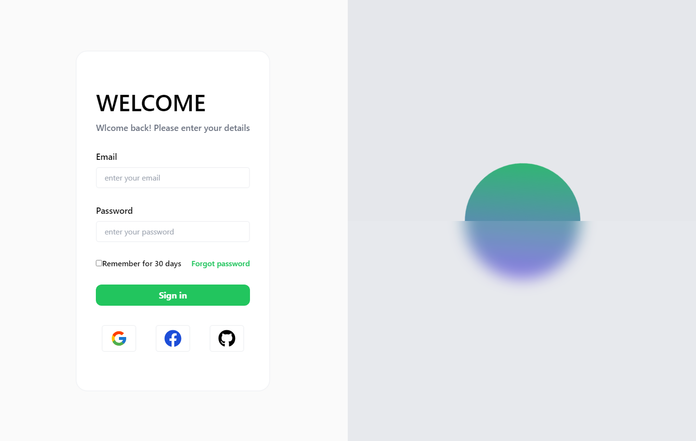

# Login v1 con tailwind css, React y Vite

## Descripción

Este proyecto es un formulario de inicio de sesión simple construido con Tailwind CSS, Vite y React. Proporciona una estructura básica que puedes ampliar y personalizar. 

## Capturas de Pantalla



## Características

- Formulario de inicio de sesión simple.
- Integración de Tailwind CSS para estilos rápidos.
- Configuración de Vite para desarrollo rápido.
- Componentes React para una estructura modular.

## Requisitos Previos

Asegúrate de tener Node.js y npm (o yarn) instalados en tu máquina.

Para crear el proyecto con Vite
```bash
git clone https://github.com/tu-usuario/tu-proyecto.git
```
Para instalar Tailwind Css
```bash
npm install -D tailwindcss postcss autoprefixer
npx tailwindcss init -p
```

Add the paths to all of your template files in your tailwind.config.js file.

```javascript
/** @type {import('tailwindcss').Config} */
export default {
  content: [
    "./index.html",
    "./src/**/*.{js,ts,jsx,tsx}",
  ],
  theme: {
    extend: {},
  },
  plugins: [],
}
```

Y en index.css
```javascript
@tailwind base;
@tailwind components;
@tailwind utilities;
```


O simplemente clonar el repositorio 
```bash
git clone https://github.com/Alangh0011/Login-UI-UX.git
cd Login-UI-UX
npm install
npm run dev